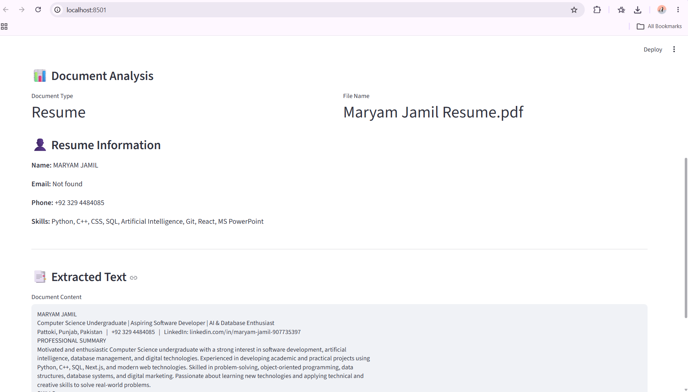
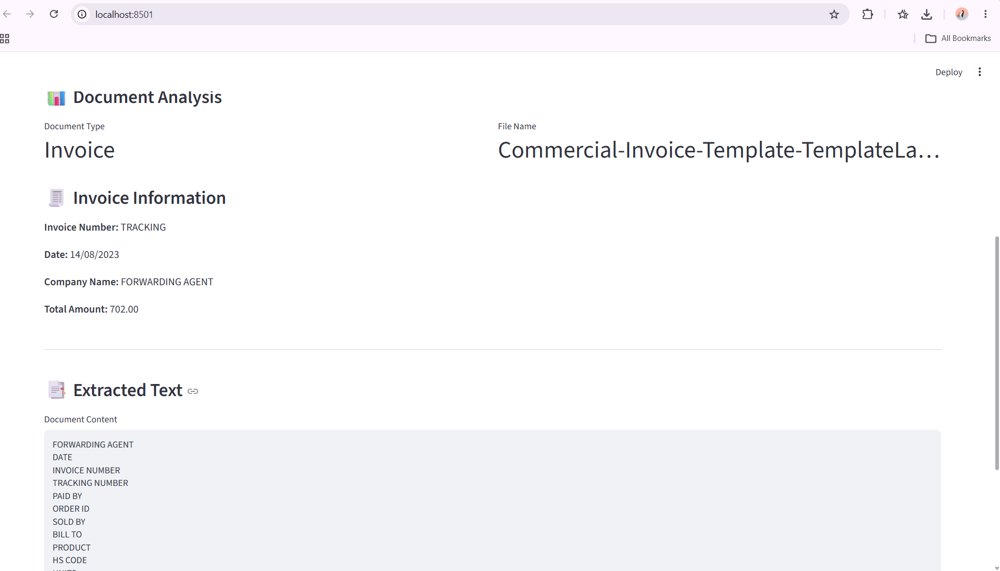
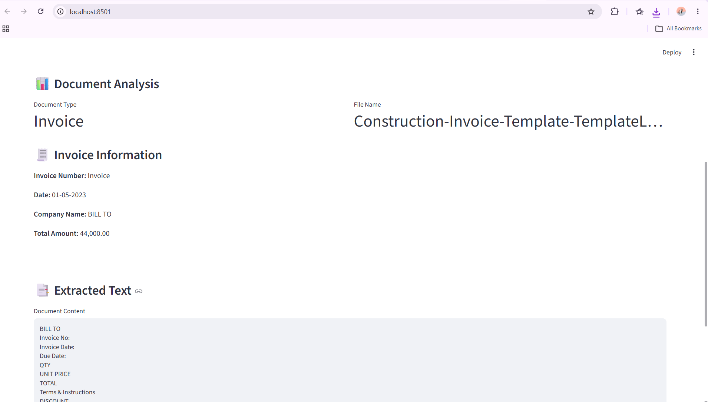
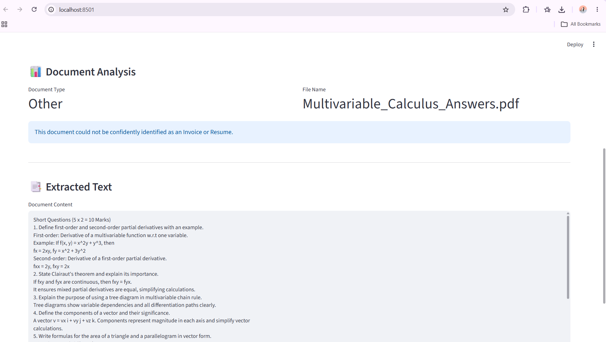

# AI Document Intelligence

A simple Document Intelligence MVP built with Python and Streamlit for the **Zyroo AI/ML Internship Program**.

The application allows users to upload documents, extract text, identify the document type, and extract basic information from invoices and resumes.

## Features

* Upload PDF, JPG, JPEG, and PNG documents
* Extract text from normal PDF files using PyMuPDF
* Extract text from images using Tesseract OCR
* Identify documents as:

  * Invoice
  * Resume
  * Other
* Extract basic invoice information:

  * Invoice Number
  * Date
  * Company Name
  * Total Amount
* Extract basic resume information:

  * Name
  * Email
  * Phone
  * Skills
* Display the extracted document text
* Simple and beginner-friendly Streamlit interface

## Technologies Used

* Python
* Streamlit
* PyMuPDF
* Tesseract OCR
* Pytesseract
* Pillow
* Regular Expressions (Regex)

## Project Structure

```text
ai-document-intelligence/
│
├── app.py
├── document_processor.py
├── ocr_processor.py
├── requirements.txt
├── README.md
├── .gitignore
│
└── screenshots/
    ├── 01_resume_test.png
    ├── 02_invoice_test.png
    ├── 03_invoice_test.png
    └── 04_other_document_test.png
```

## How It Works

The application follows a simple document intelligence workflow:

**Upload → Read Text → Identify Document Type → Extract Information → Display Results**

### 1. Upload Document

The user uploads a PDF, JPG, JPEG, or PNG document through the Streamlit interface.

### 2. Read Text

* Normal PDF files are processed using PyMuPDF.
* Image documents are processed using Tesseract OCR.

### 3. Identify Document Type

The application uses simple keyword-based rules to classify documents as:

* Invoice
* Resume
* Other

### 4. Extract Information

For invoices, the application attempts to extract:

* Invoice Number
* Date
* Company Name
* Total Amount

For resumes, the application attempts to extract:

* Name
* Email
* Phone
* Skills

If a field cannot be detected, the application displays **Not found**.

## Testing

The application was tested with multiple document types.

### Test 1 — Resume

The application successfully identified the uploaded resume as a **Resume** and extracted basic information such as name, phone number, and skills.



### Test 2 — Commercial Invoice

The application successfully identified the uploaded commercial invoice as an **Invoice** and extracted invoice-related information.



### Test 3 — Service Invoice

The application successfully identified another invoice document as an **Invoice** and extracted basic invoice information.



### Test 4 — Other Document

A CNF Multiple Choice Questions PDF was tested. The application successfully extracted the text but classified the document as **Other**, since it did not match the Invoice or Resume keyword rules.



## OCR Support

The application uses **Tesseract OCR** to extract text from image-based documents such as JPG, JPEG, and PNG files.

OCR is useful when the document contains text that cannot be directly selected or extracted as normal PDF text.

## Limitations

This project is a simple beginner-level Document Intelligence MVP.

* Classification is based on keyword matching.
* Field extraction uses regular expressions and simple rules.
* Complex document layouts may not be handled perfectly.
* OCR accuracy depends on image quality.
* Some fields may be displayed as **Not found** if they cannot be detected.

## How to Run Locally

Clone the repository:

```bash
git clone https://github.com/maryamjami24/zyro-aiml-internship.git
```

Move into the project directory:

```bash
cd zyro-aiml-internship/ai-document-intelligence
```

Install the required dependencies:

```bash
pip install -r requirements.txt
```

Run the Streamlit application:

```bash
streamlit run app.py
```

The application will open in the browser.

## Success Criteria

The project completes the required workflow:

**Upload → Read → Identify → Extract → Display**

It supports document upload, PDF text extraction, OCR, basic document classification, basic information extraction, and a Streamlit user interface.

## Author

**Maryam Jamil**

BS Computer Science Student
Zyroo AI/ML Internship Program
